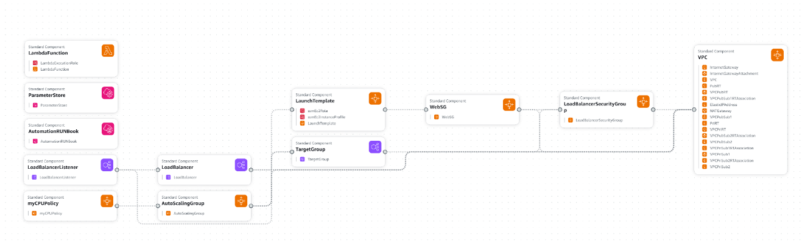

# Purpose
This template is to fully create ami patch and updater for autoscaling group template , to pick up only the last updated image for the next schduling :



# Installation 

After configuring the aws access for the your user , you need to create new cloudformation template using this command :

```bash
aws cloudformation create-stack --stack-name AMIAutoUpdate --template-body file://templates/UpdateMyLatestASGAmi.yml